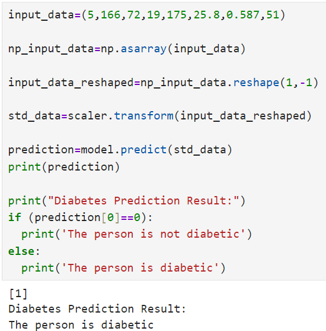

# 🩺 Diabetes Prediction using Machine Learning

This project predicts whether a person is diabetic or not using Machine Learning.

## 🚀 Run on Colab

---

## 🚀 Features

* Data preprocessing & scaling
* Model training using Scikit-learn
* Real-time prediction

---

## 🛠 Tech Stack

* Python
* NumPy, Pandas
* Scikit-learn

---

## 📊 Model Performance
- Training Accuracy: 78.66%
- Test Accuracy: 77.27%
  
---

## 📸 Output

---

## 💡 Use Case

This project can help in early detection of diabetes using Machine Learning.

---

## 👨‍💻 Author

Deepak
